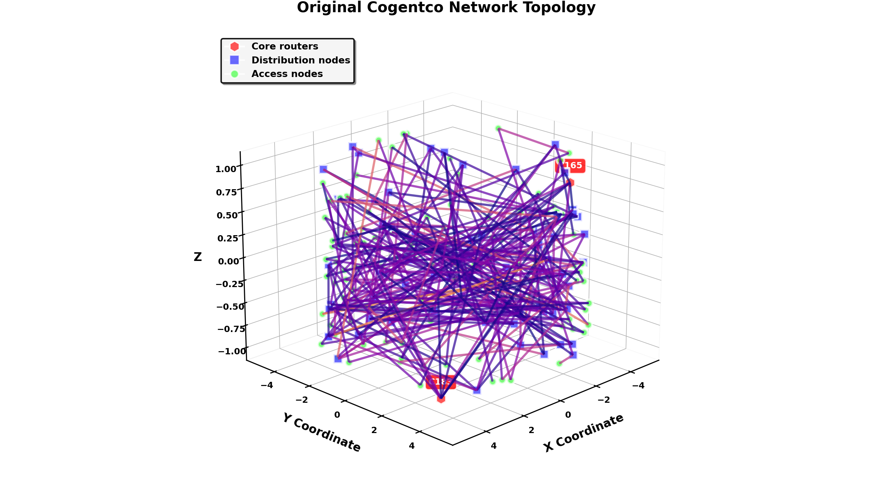
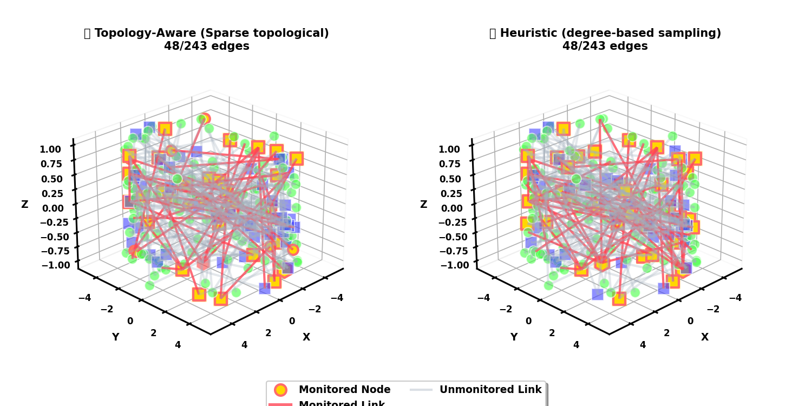
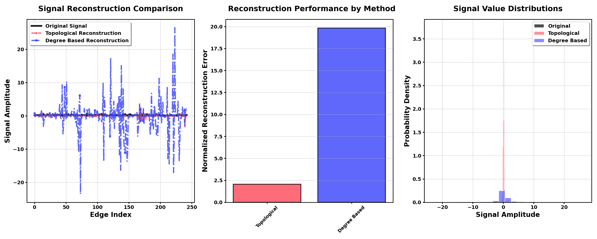
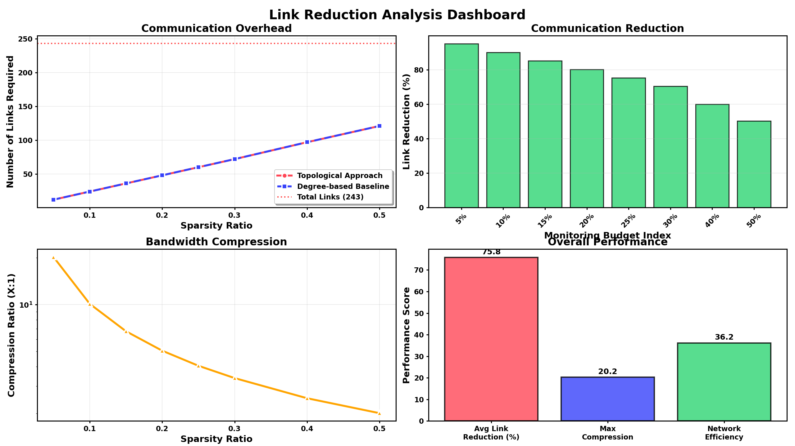

# Sparse Topological Digital Twin

This project implements a **Sparse Topological Network Digital Twin (ST-NDT)** for communication networks.  
The goal is to reduce the amount of information that must be exchanged between the **physical network** and its **digital twin**, while still being able to reconstruct the full network state with good accuracy.

---

## 🔹 Key Idea
- Instead of monitoring *all* network links, we monitor only a **small subset of “sensors” (links and nodes)** chosen using:
  1. **Topological approach** – uses spectral graph theory and topology (Hodge decomposition, Laplacians, eigenbasis).
  2. **Degree-based baseline** – a simple heuristic that selects edges connected to high-degree nodes.
- Using this sparse set of measurements, we **reconstruct the full link traffic/state** using a low-dimensional approximation.

This reduces:
- **Communication overhead** (fewer links to monitor).  
- **Bandwidth / information volume** (compressed transfer to the twin).  
- **Computation costs** on the digital twin side.  

---

## 🔹 Workflow
1. **Build network topology** from a dataset (e.g., [Topology Zoo](https://github.com/afourmy/3D-internet-zoo/tree/master)).
2. **Select sparse sensors** (edges/nodes) using either:
   - Topological QR-based pivoting, or  
   - Degree-based baseline.  
3. **Measure only the selected subset** and send these to the digital twin.  
4. **Reconstruct the full edge signal** (traffic load, flow, or state) from sparse samples.  
5. **Analyze efficiency**:
   - Link reduction
   - Bandwidth compression
   - Reconstruction accuracy

---

## 🔹 Example Results
- **Full Topology vs. Sampled Topology**  
    
    

- **Signal Reconstruction performance**  
  

  - **Link Reduction Analysis**  
  
    

These show how many links we can remove while still being able to reconstruct the overall network state.

---

## 🔹 Features
- Hodge decomposition of flows (irrotational, solenoidal, harmonic components).  
- Sparse reconstruction using bandlimited graph signals.  
- Comparison of different sampling strategies.  
- Visualization for link reduction, compression ratios, and efficiency.  
- Anomaly detection using changes in harmonic energy.  

---
## 🔹 Getting Started

```bash
git clone https://github.com/johnsengendo/Topological_approach.git
